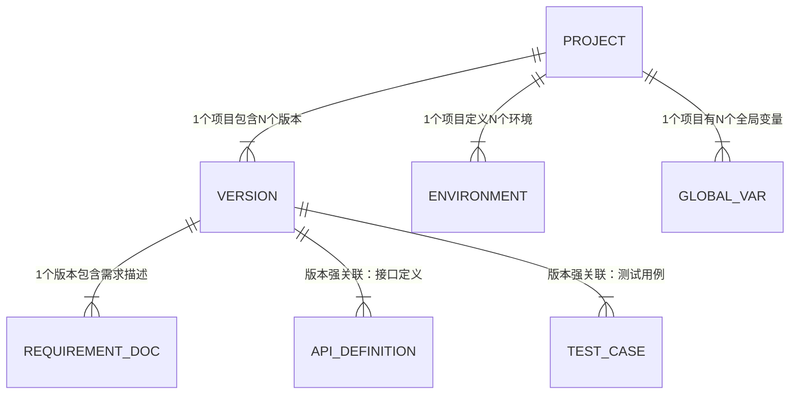

### 0. 项目与空间管理中心 (Project & Version Hub)

**设计核心理念**：
*   **唯一标识**：一切资产（接口文档、用例、脚本、报告）必须挂载在 `Project_ID` + `Version_ID` 下。
*   **资产继承**：版本之间不是孤立的，必须设计“资产继承/克隆”机制（V1.1 基于 V1.0 的数据演进）。
*   **上下文注入**：为 AI 提供项目级的“元数据”（技术栈、业务类型），这是 AI 生成准确代码的前提。

#### 0.1 项目管理 (Project Profile)
*定义项目的静态属性，也就是 AI 的“长期记忆”和“背景知识”。*

| 功能点 | 详细描述 | 交互/输入项 | 后端逻辑/数据处理 |
| :--- | :--- | :--- | :--- |
| **创建/编辑项目** | 建立项目的基本容器。 | - 项目名称 - 项目描述 - **业务领域**（下拉：电商/金融/SaaS/社交，用于AI Prompt微调） - 项目Logo | 生成唯一 `project_id`。 |
| **技术栈画像配置**  *(AI 核心依赖)* | 告诉 AI 这个项目是用什么写的，以便生成匹配的代码。 | - **后端语言**：Java/Python/Go/Node - **框架**：Spring Boot/Django/Gin - **数据库**：MySQL/PgSQL/Mongo - **前端框架**：Vue/React | 将这些 Tag 存储为项目的 System Prompt 上下文。例如生成单测时，AI 会根据“Java+Spring”自动选择 JUnit5 + Mockito。 |
| **全局知识库挂载** | 上传不随版本频繁变更的全局文档。 | - 数据字典 (SQL/Excel) - 架构图 (Image/PDF) - 错误码定义表 | 文件解析 + 向量化存储 (RAG技术准备)，供后续 AI 检索引用。 |
| **项目归档/激活** | 软删除机制。 | - 状态切换开关 | 归档后项目只读，不可新增版本。 |

#### 0.2 版本迭代管理 (Version Control) —— *【核心引擎】*
*定义项目的动态演进，实现数据的隔离与继承。*

| 功能点 | 详细描述 | 交互/输入项 | 后端逻辑/数据处理 |
| :--- | :--- | :--- | :--- |
| **版本列表** | 展示该项目下的所有历史版本轨迹。 | - 列表展示：版本号、状态、创建时间、用例数统计 | 按创建时间倒序排列。 |
| **新建版本 (迭代初始化)** | **核心逻辑：资产继承**。 通常新版本不是从零开始，而是基于上一个版本。 | - **版本号** (如 V1.2.0) - **父版本选择** (Source Version)：选择 V1.1.0 或 "空项目" - **继承策略**：复选框 [x]继承接口定义 [x]继承测试用例 [x]继承环境配置 | 1. 创建 `version_id`。 2. **深拷贝 (Deep Copy)** 或 **引用复制** 父版本下的所有接口数据、UI脚本、用例数据到新版本表中。 3. 标记新数据为“V1.2.0 初始快照”。 |
| **版本需求规约 (人工标注)** | 代替 Jira 对接。手动输入本版本的核心变更点。 | - **变更摘要** (Textarea) - **需求文档文本** (Markdown/Text) - **重点测试范围** (Tags) | 这些文本将作为 **模块1 (需求分析)** 的输入源。AI 将基于此文本生成针对该版本的测试脑图。 |
| **版本状态流转** | 控制版本生命周期。 | - 状态：`规划中` -> `开发中` -> `测试中` -> `已发布` -> `已锁定` | **锁定逻辑**：当状态变为“已发布/锁定”时，该版本下的所有数据（用例/脚本）变为**只读**，防止历史数据被篡改。 |

#### 0.3 环境与变量管理 (Env & Config)
*虽然代码在变，但环境配置（URL/账号）通常相对稳定，建议挂在项目下，但可以在版本中引用或覆盖。*

| 功能点 | 详细描述 | 交互/输入项 | 后端逻辑/数据处理 |
| :--- | :--- | :--- | :--- |
| **环境定义** | 定义项目有哪些运行环境。 | - 环境名：Dev / Test / Staging / Prod - 基础 URL (BaseURL) | `project_id` 关联。 |
| **全局变量池 (Global Vars)** | 管理多环境下的共用变量，供接口/UI自动化使用。 | - 变量 Key：`token`, `db_host`... - **多环境值映射**：   Dev: `192.168.1.1`   Prod: `api.bugseek.com` - **敏感标记**：是否加密显示 | 存储时加密。执行测试时，根据用户选择的“运行环境”，动态替换变量值。 |
| **数据库连接配置** | 用于 AI 自动造数或断言数据库。 | - 别名 (Alias) - JDBC URL / Connection String - 账号密码 | 验证连接连通性。**注意**：不做复杂的权限管控，但需前端脱敏展示密码。 |

#### 0.4 可拓展性预留 (Future Proofing)
*虽然现在不开发，但数据库设计需预留字段。*

*   **成员字段 (Member)**：在 Project 表预留 `created_by` (UID), `owner_id` (UID)。目前默认填 "admin" 或当前单用户 ID。
*   **WebHook 字段**：在 Version 表预留 `notification_url`，未来可填入飞书/钉钉机器人地址，用于手动触发通知。
*   **审计字段**：所有核心表（Project/Version/Case）必须包含 `created_at`, `updated_at`, `is_deleted` (软删除标记)。

---

### 💡 针对“单用户 + 人工标注”模式的特别建议

由于您暂时切断了第三方对接，**BugSeek 的“智能感”将高度依赖于 0.2 节中的【版本需求规约】输入质量**。

**建议增加一个“AI 预处理助手”功能在版本创建环节：**
*   **场景**：用户在创建 V1.2 版本时，在文本框里粘贴了一大段杂乱的聊天记录或非结构化的需求草稿。
*   **功能**：增加一个 **"一键结构化"** 按钮。
*   **效果**：调用 LLM 将杂乱文本整理成标准的 Markdown 格式（新增功能、修改功能、删除功能），然后再保存到版本描述中。这样为后续模块 1 的用例生成打下高质量基础。

### 总结：数据实体关系图 (ER 简述)

这个设计方案既满足了您当前 MVP 的极简需求（无复杂权限、无三方对接），又通过 **“版本继承”** 和 **“技术栈画像”** 两个关键点，为 AI 的介入和未来的扩展留足了接口。